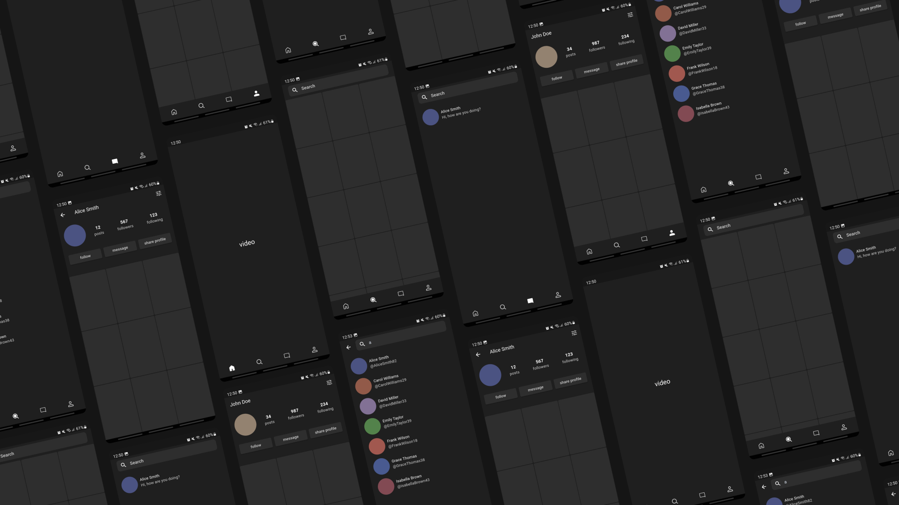

# Skill snap
A Social Learning Platform for Bite-Sized Knowledge

MicroLearn is a social learning platform designed to make education accessible, engaging, and efficient. Inspired by popular social media platforms like TikTok and Instagram, MicroLearn offers users a unique way to consume and share micro-learning content.


## Key Features:
1. **Micro-Learning Content**: Users can create and share short, informative videos on a wide range of topics, from science and technology to history and arts.
2. **Personalized Feeds**: MicroLearn's algorithm curates personalized feeds based on user interests, ensuring a seamless and engaging experience.
3. **Interactive Elements**: Users can interact with content through likes, comments, and shares, fostering a vibrant community.


## Getting Started:
To get started with the app, simply clone the repository and follow the setup instructions in the README.md file. Whether you're baking for pleasure or professionally, the app is here to elevate your dough-making experience.

## Instructions
### Prerequisites:
Before you begin, ensure you have the following installed on your system:
1. **Flutter SDK**: Make sure you have Flutter installed on your machine. If not, you can follow the official Flutter installation instructions here.
2. **Git**: You'll need Git to clone the the app repository. You can download and install Git from here.
### Installation:
Follow these steps to install The application:

1. Clone the Repository:
```
https://github.com/JelleBuning/skill-snap.git
```
2. Navigate to the Project Directory:
```
cd skill-snap
```
3. Get Dependencies:
```
flutter pub get
```

### Building the app:
1. Debug the app:
```
flutter run
```
2. Create APK:
```
flutter build apk --release
```

## Feedback and Support:
Have feedback or need assistance? Feel free to open an issue on the repository, and i will be happy to assist you. Your input is invaluable as we continue to improve the application.
